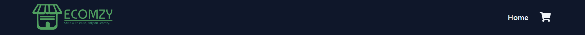

# React Shopping Cart Application

## Overview

This document outlines the structure and components of a simple React-based shopping cart application. The application allows users to browse products, add them to their cart, and view the cart with a summary of all added items.

### Project Structure

- `App.js` - The main entry point of the React application which sets up routing and layout.
- `Pages/`
  - `Home.jsx` - Displays all products and handles product data fetching.
  - `Cart.js` - Manages and displays the shopping cart's state, including products added, total amount, etc.
- `Components/`
  - `Navbar.jsx` - Displays the navigation bar with links to Home and Cart pages.
  - `Product.jsx` - Represents a single product card.
  - `CartItems.jsx` - Displays an individual item in the cart.
- `Redux/`
  - `Slice/`
    - `CartSlice` - Manages the Redux state for cart operations.

    

## Main Components

### App Component

- **File:** `App.js`
- **Description:** Serves as the root component which uses React Router for handling navigation between the `Home` and `Cart` pages.
- **Components Used:**
  - `Navbar`
  - `Home`
  - `Cart`
- **Routes:**
  - Home (`/`)
  - Cart (`/cart`)

### Home Component

- **File:** `Pages/Home.jsx`
- **Functionality:** Fetches product data from an external API and displays products. It shows a loading spinner while the data is being fetched.
- **API Used:** `https://fakestoreapi.com/products`

### Cart Component

- **File:** `Pages/Cart.js`
- **Functionality:** Displays all items added to the cart, calculates the total price, and manages state updates when items are added or removed using Redux.

### Components

#### Navbar

- **File:** `Components/Navbar.jsx`
- **Description:** Provides navigation between the Home and Cart pages, and displays a cart icon with a count of items in the cart.

    

#### Product

- **File:** `Components/Product.jsx`
- **Description:** Displays a single product and includes buttons to add or remove the product from the cart.

    

#### CartItems

- **File:** `Components/CartItems.jsx`
- **Description:** Displays individual cart items, allows removal of items from the cart, and displays the item's details such as title, description, and price.

## Redux State Management

- **CartSlice:** Manages the state of the cart including adding and removing items. Uses `react-redux` for global state management across components.

### Deployment

This application is set up for local development.

- Showing some of pictures application.

